This white paper presents a framework, principles, and a model for a human-centric approach to the managing and processing of personal information. The approach – defined as MyData – is based on the right of individuals to access the data collected about them. The core idea is that individuals should be in control of their own data. The MyData approach aims at strengthening digital human rights while opening new opportunities for businesses to develop innovative personal data based services built on mutual trust.

# MyData Principles

1. **Human centric control and privacy:** Individuals are empowered actors, not passive targets, in the management of their personal lives both online and offline – they have the right and practical means to manage their data and privacy.

2. **Usable data:** It is essential that personal data is technically easy to access and use – it is accessible in machine readable open formats via secure, standardized APIs (Application Programming Interfaces). MyData is a way to convert data from closed silos into an important, reusable resource. It can be used to create new services which help individuals to manage their lives. The providers of these services can create new business models and economic growth to the society.

3. **Open business environment:** Shared MyData infrastructure enables  decentralized management of personal data, improves interoperability, makes it easier for companies to comply with tightening data protection regulations, and allows individuals to change service providers without proprietary data lock-ins. 

Contributors: Antti Eskola, Juuso Parkkinen, Mark Lizar, Molly Schwartz, Myles Byrne, Samuel Rinnetmäki and Tuukka Lehtiniemi

# 1 - What is MyData?

The term **MyData** refers 1) to a new approach, a paradigm shift in personal data management and processing that seeks to transform the current organization centric system to a human centric system, 2) to personal data as a resource that the individual can access and control. Personal data that is not under the respective individual's own control cannot be called MyData.

The aim is to provide individuals with the practical means to access, obtain, and use datasets containing their personal information, such as purchasing data, traffic data, telecommunications data, medical records, financial information and data derived from various online services and to encourage organizations holding personal data to give individuals control over this data, extending beyond their minimum legal requirements to do so.

Personal data has increasingly significant social, economic, and practical value. According to The World Economic Forum, *"Personal data is becoming a new economic asset class, a valuable resource for the 21st century that will touch all aspects of society"*. The wider application and use of personal data, however, is often conflated with negative predictions of a future devoid of individual privacy.

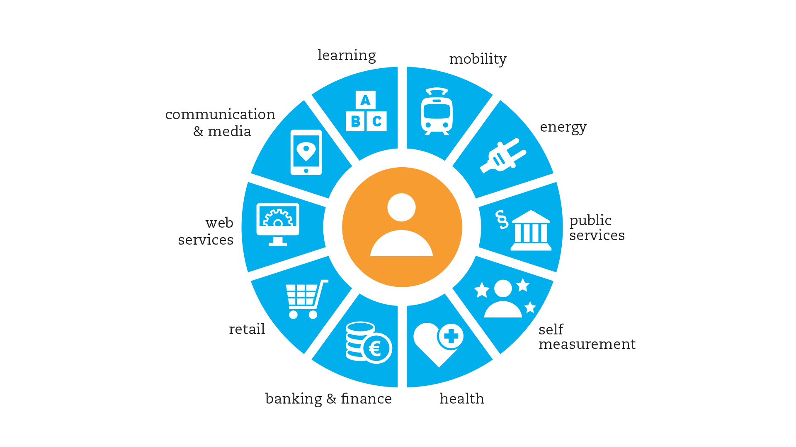

Currently, individuals have little or no control over how data about them and their activities is created or used by businesses, governments, or data brokers. By giving individuals the power to determine how their data can be used, the MyData approach enables the collection and use of personal data in ways that maximize the benefits gained while minimizing the privacy lost.

Personal data is presently an underused 'raw material' for new services due to the lack of interoperability and portability between datasets across services and sectors. We need a new **infrastructure level** approach on how to manage personal data.

The growth of Big Data analytics has brought privacy issues to the forefront. Regarding the ethical use and analysis of personal information, MyData and Big Data are complementary rather than mutually exclusive concepts.The concept of Big Data emphasizes the potential of combining and analyzing large datasets from the organization's perspective while MyData focuses on the individual’s ability to control and benefit from the value of his or her personal data. The MyData approach provides organizations with the practical means for implementing data protection and privacy in the course of big data analytics and brings individuals transparency as to how their data are being collected and processed. Without addressing the human perspective, many of the potential innovative uses of big data might become impossible if individuals perceive them as invasive, shadowy, and unacceptable. 

The MyData approach incorporates the ‘Open Data’ movement philosophy that providing access to information in a free and transparent format increases its usefulness and value. By definition, Open Data is technically and legally free for anyone to use, reuse, and distribute. Similarly, data collected about a person will meet the criterion of MyData if it is technically and legally available for the individual to use, reuse, and distribute as s/he wishes.

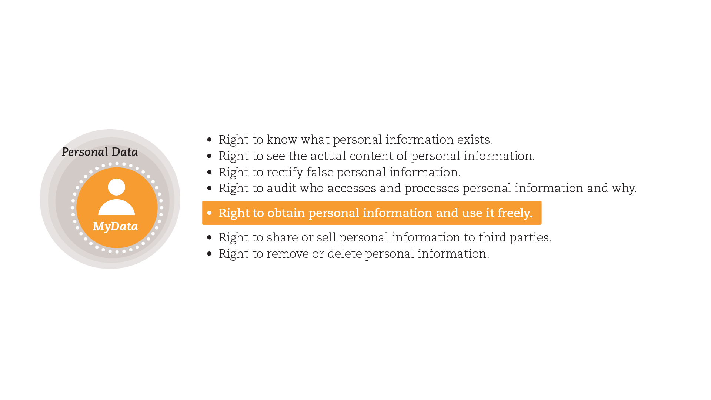

Figure 1.2: Rights and the level of control that individuals have over their personal information can vary. The minimum requirement for MyData is that individuals have the right to access and use their personal data.

**MyData is:**

* An infrastructure-level approach for ensuring data interoperability and portability – open infrastructures make it possible for individuals to change service providers without proprietary data lock-ins

* Sector independent – there is currently significant progress being made in individual sectors, such as health and finance, but a cooperative approach could work across all sectors

* Consent-based data management and control – it is not necessary for the individual to store all his/her data in centralized repositories in order to control the data flow

# 2 - What are the benefits of MyData?

We think the individuals should have legal right and technical tools to manage personal data collected on them. This is a means of digital identity management and an extension to the freedom of thought and expression we all have as citizens. At the same time, organizations should have practical methods for getting individuals’ consent to use their personal data when they discover innovative new uses or applications.

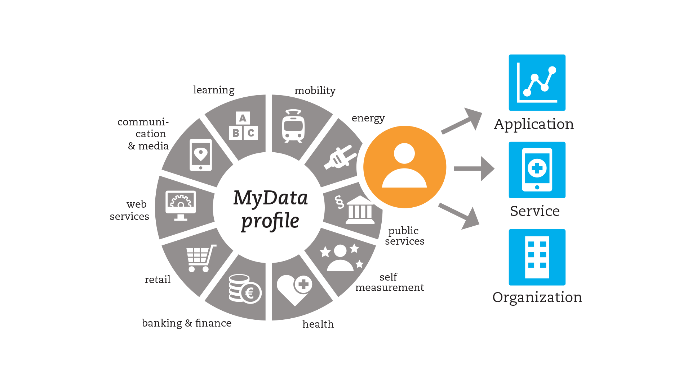

Figure 2.1: Individual may obtain personal data from all areas of life and across all sectors and share selected parts of this rich MyData profile with service providers and applications.

As the situation currently stands, individuals grant legal consent to organizations and software applications for the collection and use of their personal data online through the standard practice of  clicking "yes" that they have read and agreed to terms of service that they usually do not understand and have no realistic way of enforcing. On the other hand, under the current state of data protection regulations, it is often prohibitively difficult for organizations to create innovative services around personal data – organizations are frequently deterred from innovating or may try to figure out ways to bypass existing regulations.

MyData is a progressive approach to personal data management that combines digital human rights and industry need to have access to data. This approach benefits individuals, organizations, and society at large. MyData enables individuals to aggregate intelligence about themselves from multiple sources (see Figure 2.1). With this rich and valuable data the individuals can interact with vendors who can provide more valuable data- and consumer services.

**For individuals** – MyData provides easy-to-use and comprehensive tools for personal data management, transparency mechanisms that openly show how organizations use their data. The individuals also enjoy the benefits of the new innovative services and increased freedom of choice.

**For companies** – MyData opens opportunities for new kinds of data-based businesses by facilitating the legal and technical access to pre-existing personal datasets when the individual is willing to give his/her consent. MyData is based on standards and developed to support interoperability. This lowers the barrier of entry for new businesses and makes the landscape more balanced and competitive. 

**For civil society** – MyData creates the necessary structures, processes, and policies for protecting the rights of individuals and fostering the use of personal data in the development of innovative services.

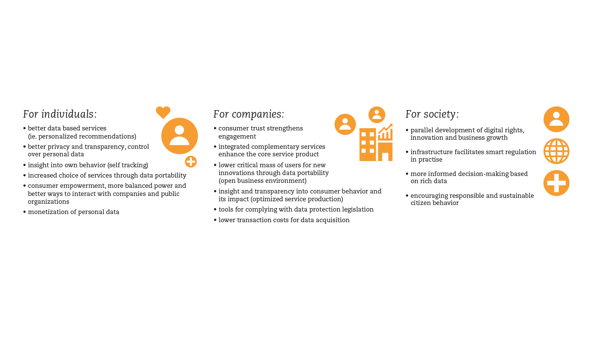

For individuals:

* better data based services (ie. personalized recommendations)

* better privacy and transparency, control over personal data

* insight into own behavior (self tracking)

* increased choice of services through data portability

* consumer empowerment, more balanced power and better ways to interact with companies and public organizations

* monetization of personal data

For companies:

* consumer trust strengthens engagement

* integrated complementary services enhance the core service product

* lower critical mass of users for new innovations through data portability (open business environment)

* insight and transparency into consumer behavior and its impact (optimized service production)

* tools for complying with data protection legislation

* lower transaction costs for data acquisition

For society:

* parallel development of digital rights, innovation and business growth

* infrastructure facilitates smart regulation in practice

* more informed decision-making based on rich data

* encouraging responsible and sustainable citizen behavior

Figure 2.2: Benefits of MyData approach to the individuals, companies (and other organizations) and civil society.

# 3 - Why is MyData an infrastructure level approach?

MyData reforms the personal data ecosystem at the infrastructure level – but are such high-level reforms necessary? Wouldn’t it be easier to simply open personal data APIs to all services and let organizations negotiate and connect directly amongst themselves?

Having access to personal data via APIs is critical for most MyData-based service scenarios. The "API economy" is already developing into an organically expanding ecosystem of services that exchange personal data over point-to-point connections. However, organizations struggle to manage their API integrations, while individuals are lost with the big-picture view of their personal data flows between services. In the long run, some systemic restructuring will be a necessity. The current API economy can be seen as an incubation stage for the forthcoming data economy. However, we will need also a more robust infrastructure on top of the mere APIs.

As the situation currently stands, personal data aggregators are emerging within specific sectors, such as Validic and Human API in the health sector, in addition to the well-established data powerhouses such as Google, Facebook and Apple that are streamlining the flow and interoperability of personal data within their own ecosystems. The data aggregator model is naturally evolving out of the API economy, but it presents two fundamental drawbacks. First, the lack of interoperability between data aggregators means that individuals and companies become locked into specific data service providers and the data market is fragmented in a way that stifles innovation and inconveniences people. Secondly, the current crop of data aggregators do not necessarily acknowledge privacy or engage in a transparent manner with the individuals who are their data subjects. There are several initiatives that aim to create a more open and privacy aware model (such as Qiy, The Good Data, Respect Network), but in the absence of a common infrastructure, these also suffer from a lack of interoperability.

The key concept in the proposed MyData infrastructure is the MyData account. For an individual, the MyData account is a single hub for personal data management.Via the account individual can give services the authority to access and use his or her personal data. The account stores information on how the individual’s personal data is connected to different services and the legal permissions and consents for using the data.

Adopting the MyData approach could ultimately lead to a systemic simplification of the personal data ecosystem. Nonetheless, MyData is not an all-or-nothing approach. Rather, it can be developed and deployed in stages concurrently alongside the evolving API economy and the existing data aggregator model.

Figure 3.1: In the current structureless API economy, if the number of services grow, then the number of connections between them grow at a faster rate (top). Aggregating data control would make life easier for organizations and individuals, but different aggregators do not have a built-in incentive to develop interoperability between them (middle). Compared to the aggregation model, MyData is resilient system because it is not dependent on a single organization or technical infrastructure (bottom).

**We need infrastructure as it:**

* anticipates wide adoption of APIs and overall increased demand for personal data logistics

* enables individuals to have practical and comprehensive control over their digital consents

* can facilitate human-centric monetization of personal data

# 4 - How does MyData approach work in practice?

The MyData architecture is based on interoperable and standardized MyData accounts. The account model provides individuals with an easy way to control their personal data from one place even while the data is created, stored, and processed by hundreds of different services. For developers, the account model facilitates access to data and removes dependencies on specific data aggregators. MyData accounts will generally be provided by organizations that act as MyData operators. For organizations or individuals willing to be operator-independent, it will also be technically possible to host individual accounts, just as some people currently choose to host their own email servers.

In the MyData architecture, data flows from a data source to a service or application that uses the data. It is important to understand that within the MyData infrastructure, the flow of consents or permissions is separate from the actual flow of data (see Figure 4.1). The MyData account should not be confused with personal data storage (PDS) solutions, that enable storing data in a secure place under the direct control of an individual custodian. The primary function of a MyData account is to enable consent management – the data itself is not necessarily streamed through the servers where the MyData account is hosted.

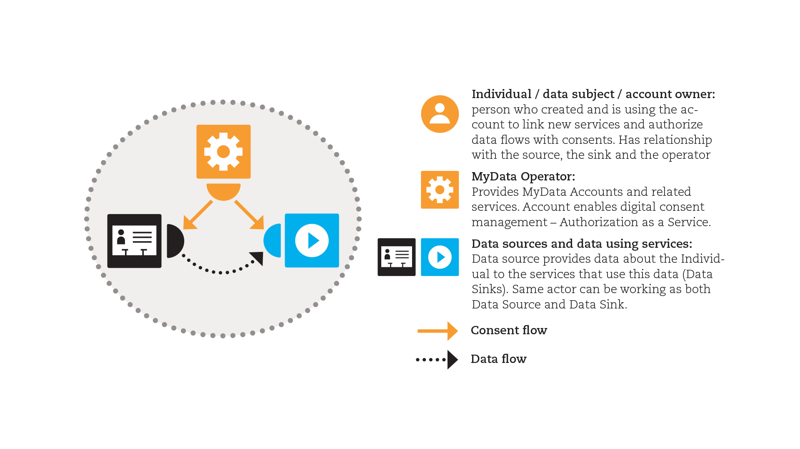

Figure 4.1: Four defined roles within the MyData architecture include 1) individual, 2) MyData operators, 3) data sources, and 4) the services using data. The flow of consents or permissions to use the data is separate from the actual flow of data.

Application Programming Interfaces (APIs) enable interaction between data sources and data users. MyData-compliant APIs provide data in a machine readable format and also enable the data sources and users to exchange information with the MyData account. As a result, it is possible to build a centralized dashboard where the individual may grant access and give or cancel permissions for multiple data sources and services. Any service provider can build a MyData API and enable their service to be connected with MyData accounts directly. If the service does not have a MyData-compliant API, it can be connected via a MyData proxy service.

Standardized MyData architecture makes the accounts interoperable and allows individuals to easily switch operators. This is major element contributing MyData’s trustworthiness. Interoperability is the core advantage provided by MyData, but it is also the core challenge. Interoperability within the data management system can be understood as functioning similarly to interoperability in mobile telephone networks. Both systems require a common network that connects distributed nodes. Global interoperability and transferability of MyData accounts (and thus individual’s consents) between operators requires further standardization and design on e.g. trust networks, data formats, and semantics.

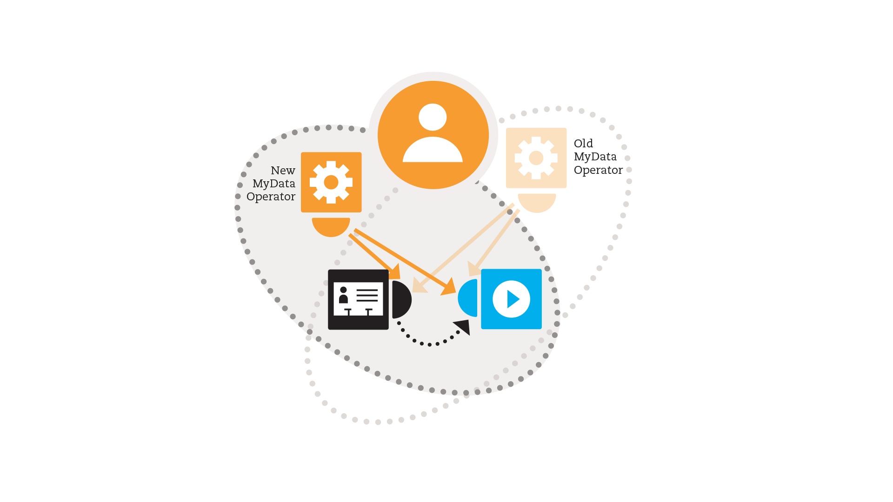

Figure 4.2: Individuals can change their MyData operator without losing their MyData account content. This mechanisms increases trustworthiness of MyData approach and encourages people to create data flows.

**MyData approach works in practice:**

* MyData accounts hold consents that determine how data can flow from data sources to data users in an authorized system.

* For personal data management it is sufficient for the authorization consents to be centralized in the MyData account. Data can flow directly between the source and the user.

* Due to account portability, individuals can easily choose and change their MyData operator service. The service provider lock-in is minimal.

# 5 - Why is MyData focused on consent?

MyData intends to build trust in personal data services through a combination of transparency, interchangeability, public governance, respectable companies, public awareness, and secure technology. Consent management is the primary mechanism for permitting and enforcing the legal use of data. Via MyData accounts individuals can instruct the services to fetch and process data in accordance with consents that the individual has granted to data services. In technical and legal terms, consent is equivalent to authorization.

In the MyData model, consents are dynamic, easy for people to comprehend, machine-readable, standardized, and managed in a coordinated way. A common format will make it possible for every individual to delegate data processing to third parties or to repurpose the use of data in new ways (see Figure 5.1). 

Figure 5.1: Examples how MyData approach can support different kinds of data flow use cases such as delegation, repurposing, notification and data flow through the personal data storage (PDS)

MyData consent management structures can be developed by using the open consent meta-format (Kantara Initiative). The open consent format is compliant with common consent regulations across jurisdictions and it is designed to operate smoothly also under the forthcoming EU data protection legislation (EU General Data Protection Regulation). The legislation is expected to require that  data subjects give their explicit and informed consent to services that will use their personal data, unless a consent exemption or a legitimate interest takes precedent. In order for companies to both comply with tightening regulations and to continue to provide innovative services, it will be necessary to create a functional, interoperable, and easy-to-use consent management system.

Not all personal data usage requires the consent of data subjects. There has been critique that MyData could complicate the automation of services by focusing on detailed consent management, especially in cases where there is a legal base for personal data processing without consent. For example, public authorities are allowed to exchange data between each other without the consent of the data subject in certain circumstances. In such cases, the MyData infrastructure would not be used to enforce consent based data management, but it would act instead as a transparency tool to notify end-users of the use of their data. It benefits everyone if public authorities are able to exchange personal data in a transparent way. The MyData infrastructure may also act as a channel for ordinary citizens to opt out of services that involve the use and exchange of their personal data by public authorities and in more granular contexts than they deem to be acceptable.

**MyData is focused on consents because:**

* consents are the primary (but not the only) legislative framework that defines information processing from the human-centric perspective

* the same consent management framework can also be used with minor modification for notifications and assignments

* human and machine readable standardized consents unite technical data management systems, legislative frameworks, and the human perspective

# 6 - Why should companies be interested in MyData?

Companies can improve their business operations with MyData. Optimizing resource allocation, creating service pathways, providing personalized services, and producing recommendations are generic service improvements that many services can offer through better access to personal data. In addition, the MyData infrastructure would enable new kinds of services, such as vendor relationships management (VRM), people discovery, and personal data services related to large-scale research data banks and behavioral analytics.

The primary incentive for companies to create a MyData API that gives their customers and authorized third parties access to certain datasets is that it would expand their overall value proposition to customers (see Figure 6.1). Third-party vendors can collaborate more effectively with companies that hold the original data sources if they have authorized access to datasets that contain personal data.

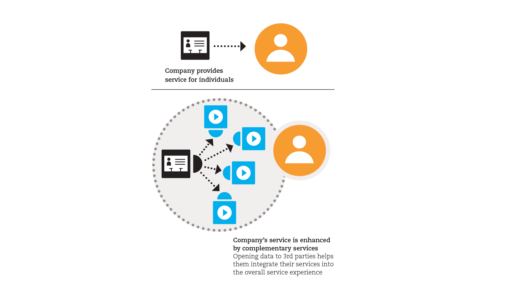

Figure 6.1:  Conventional service versus service extended with MyData-based complementary service integration

Studies show that more and more people are becoming aware of the ongoing exploitation of their personal data without their consent. If a company's behaviour is considered shady or unacceptable, it faces the risk of public criticism, lawsuits, and users opting out of services on a massive scale. Implementing MyData principles would give companies a marketing advantage. Companies can improve their customer relations by engaging with customers in new reciprocal ways, sharing data back to customers, or even generating enhanced datasets based on information that customers voluntarily choose to provide.

Currently data is sold implicitly so that the individual gets a "free" service, but willingly, or in many cases, unknowingly gives personal data to the service provider in exchange for services. The MyData infrastructure provides a simple and transparent mechanism for making data sales visible and explicit in ways that benefit both parties – either through enhanced services or direct monetary profits. Operators can facilitate data sales and share revenues with both data sources and data subjects.

For the MyData ecosystem to flourish, it is crucial that there are viable business models for MyData operators. MyData operators could charge account and transaction fees. MyData operators could also generate profits by charging a marginal rate on data sales. Value-added services operators may offer, for example, secure storage, local applications, and a marketplace for data-centric applications (see Figure 6.2).

Figure 6.2:  The MyData operator stack shows the required and optional functionalities of the MyData operator. Consent management is the baseline service for an operator, but there are multiple complementary value added services an operator can provide in MyData infrastructure for the individual

For the overall viability of the MyData approach, it is also important to set organizational and business level standards, especially for the MyData operators. Such standards are currently developed in an open operator alliance. The alliance can also facilitate the standardization of technical functionalities that enable account interoperability.

**For Companies MyData will:**

* help to integrate third party complementary services into their core services

* simplify operations within current and forthcoming regulatory landscapes and enable data use for exploratory purposes

* enable the creation of new business based on data processing and management

# 7 - How does MyData help me manage my privacy?"

MyData is a model that equips individuals to control who uses their personal data, to stipulate for what purposes it can be used, and to give informed consent in accordance with personal data protection regulations. It makes data collection and processing more transparent and it helps companies or other organizations implement comprehensive privacy protections.

As a digital service that focuses on managing and visualizing data use authorizations, the MyData account service will establish a unified environment for managing and understanding the status of one’s privacy – a service that is easier to use than the wide spectrum of point solutions available on the web today. It will be as easy to use as the common authentication mechanisms used in online services, for example. The user interface lets individuals activate or deactivate the sharing of specific dataflows and lists currently active authorizations. It would be like switching on or off a particular feature on your smartphone.

MyData addresses the concept of data control rather than data ownership. It is tempting to proclaim that individuals should own their data, but the concept of ownership as an exclusive right is difficult to apply to data. In most cases, multiple parties, including both the individuals and the organizations, have legitimate interests in the same datasets. For example, retail stores have rightful claims to use customer data that they collect using loyalty cards, while the individual card owners also have rights to the same data.

The common "I have read and agree to the terms" -acceptance mechanism is not adequate, because the terms of service and privacy policies are too long and too complicated to understand. One critique of the easy consent management approach proposed by MyData is that companies would take advantage of it by increasingly demanding access to an even a greater variety of personal data in exchange for improved services. It is important to mitigate this risk by carefully designing the consents so that they are understandable to individuals. Consents given to various data controllers are currently heterogeneous. However, the consents often contain similar elements that could be formatted among standard guidelines. When standardized, the consents can be made machine-readable and easy to compare, bundle, visualize, and process automatically. The Creative Commons licensing framework provides an example of how the equally heterogeneous sphere of author rights was harmonized according to a common set of standard licences (see Figure 7.1).

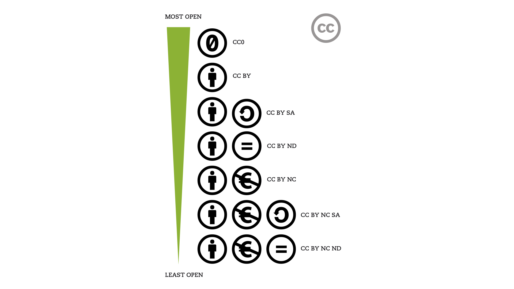

Figure 7.1: Creative commons is an example of established licensing framework that has made the management of rights practical and comprehensive. A consent commons approach aims to harmonize consents in a manner that is as comprehensive as the creative commons suite is for copyright licensing.

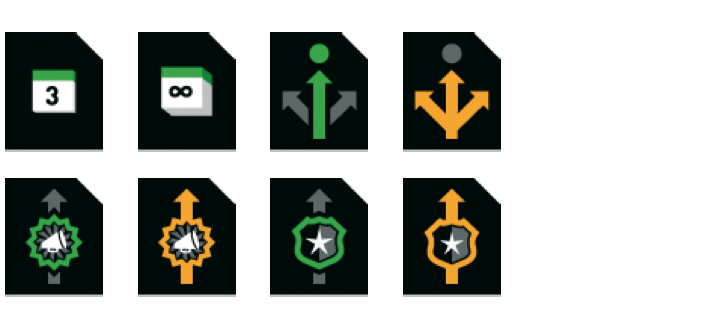

Figure 7.2: Another example of standardization but more related to MyData and personal data is the Mozilla privacy icons project by Mozilla Foundation and Aza Raskin, which is focused on creating common visual language for privacy settings in websites.

**MyData helps me manage my privacy:**

* with MyData infrastructure data flows become manageable, comprehensive, and transparent.

* users can deactivate information flows and withdraw consent

* machine-readable consents can be visualized, compared, and processed automatically.

# 8 - What are the next steps?

Progress is needed on all three of the MyData principles: human-centric control, usable data, and open business environment. Implementing human-centric control will require raising awareness and improving education around the topic, shifting the attitude among organizations and companies, and increasing regulatory awareness. Usable data requires that companies offer machine-readable personal data via APIs. An open business environment will require the development and adoption of MyData account model and common standards for MyData operator businesses.

The core technical components of MyData already exist, but they require maturation. Technical elements need to be tested and integrated into existing software, such as customer relationship management (CRM) and identity provisioning (IdP) systems. There will also be a strong emphasis on user experience design. Current demonstrations show that managing MyData accounts will be a similar experience to how people currently use online banking services to provide strong authentications and manage their finances.

Many online service companies have developed APIs and successfully integrated data flows across organizations. However, there are not many examples of more traditional companies that have opened up their data APIs. In Finland, MyData has raised interest among companies, ministries, media, and researchers. There are currently several research and innovation projects addressing challenges related to principles and the implementation of MyData, and initial pilots are in preparatory stages. Industry and research organizations have ongoing innovation projects focusing on developing the MyData operator model (see links at the back) and work on interoperability and operator alliance issues. The current operator model is being built based on the UMA standard and the Minimum Viable  Consent Receipt project. Test sandbox instances of a MyData operator are expected to be released for open tests in early 2016.

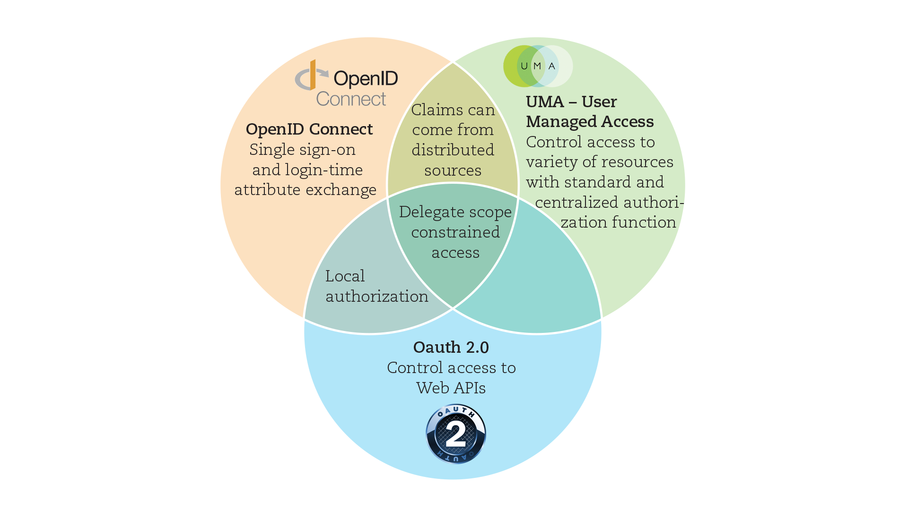

Figure 8.1: Core parts of the MyData authentication mechanism and the MyData APIs can be realized using the User-Managed Access (UMA) standard created by the Kantara Initiative (version 1.0 was released on early 2015). UMA specification and its open-source implementations let individuals to control authorizations to share their data and to manage how their data is shared between online services. UMA is a profile of OAuth 2.0 (control access to web API's) and it shares features with OpenID Connect (federated single-sign-on) It brings together two essential elements to the authorization workflow: asynchronous consent and centralized consent management. (Figure modified after Eve Maler @xmlgrrl)

The newly elected Finnish government has stated in its strategic government plan that Finland will "strengthen citizens’ right to monitor and control the use of their personal data, and at the same time guarantee the fluid exchange of data between public authorities". This combination of strategic priorities lends itself to speedier adoption of MyData principles – hopefully providing an example to the private sector to follow.

The goal of MyData is to build an infrastructure level service for the management of personal data. This work is intended to have international impact.  An efficient way to achieve functional design for a MyData system is to carry out hands-on pilot projects. On the next page, we outline a few key examples of MyData service scenarios.

**The roadmap towards MyData includes:**

* Progress on all three fronts: human-centric control, usable data, and open business environment

* Maturation of existing platform technologies and mapping out how they will comply with regulations such as EU General Data Protection Regulation (GDPR) and the specifications developed in the Europe wide electronic identity and trust services (eIDAS) initiative.

* MyData-supported service pilots

# 9 - Give me some examples!

MyData is a high-level approach for organizing personal data in human centric way. MyData principles are applicable to all areas of life. The same personal data can be used in different sectors. Some data types are specific to sectors, such as clinical health data, but the primary objective for the MyData infrastructure is to enable the flow of data between sectors. MyData can be applied to organizing healthcare data management, to developing new kinds of mobility services, to supporting individuals with their personal finances, to informing consumption decisions, and to creating new kind of research databases.

In this last chapter we describe three use case scenarios for MyData in more detail. The schematic illustrations show how the personal data, authorizations / consents, and money flow between different actors.

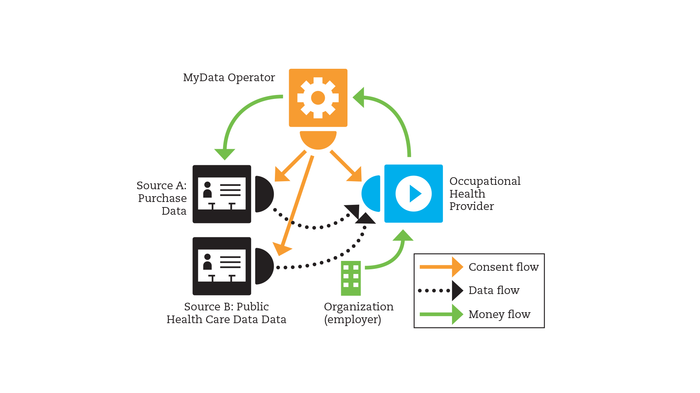

**Example 1: MyData and Occupational health**

Modern health care requires data. Clinical data usually consist of various test results and diagnosis. Occupational health care providers change when individuals change jobs. There is no convenient way to organize data logistics between different occupation health care providers. Furthermore, getting more data about individuals would significantly help personalize and optimize health and wellbeing services and provide alternative means for diagnosis. For example, an individual’s profile data, consumption data, and activity tracking data could be used for healthcare services. The MyData infrastructure can provide standardized methods for managing data logistics between different professional and public health organizations and sources of behavioral data in robust ways across organizations.

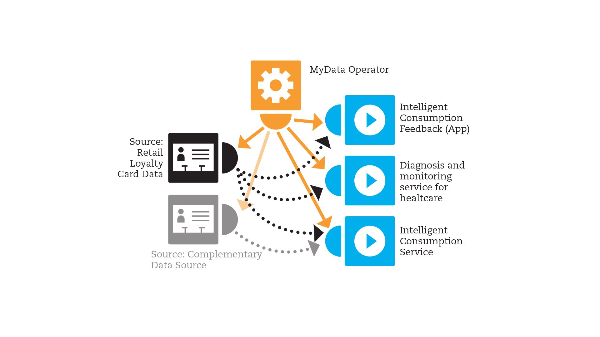

**Example 2: MyData and Loyalty card data**

Loyalty card data can reveal the individual’s consumption history, which can be used to provide health recommendations, to recommend changes in shopping behavior, and to optimize personal spending. Providing individuals with access comprehensive consumption feedback through their loyalty card data may have beneficial society-wide effects. Smarter consumers have the power to influence change production patterns. Fragmented datasets from a single loyalty cards provide limited insights into consumption behaviors, but the MyData infrastructure creates the mechanism to integrate data from multiple sources for more meaningful results.

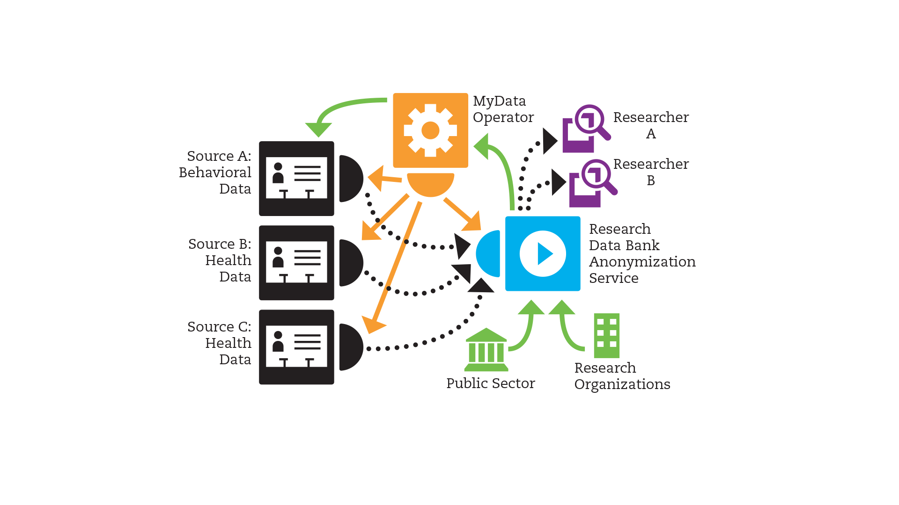

**Example 3: MyData and research data banks**

The development of computational sciences has produced flexible tools that can be used to combine and analyze multiple data sources. Integrating data from multiple sources may increase risks of privacy invasion. According to recent research, over 60% of individuals have expressed their willingness to donate their personal data for research purposes. The MyData infrastructure can provide a common framework for different kinds of research data banks to easily acquire consumers' consent to collect their data. Research data banks could then provide access to their data without violating individual privacy rights, but still maintain the capability to cross-reference data.

# Links and references

**Publications**

* The original MyData white paper in Finnish (Ministry of Transport and Communications) [http://www.lvm.fi/julkaisu/4420389/my-data-johdatus-ihmiskeskeiseen-henkilotiedon-hyodyntamiseen](http://www.lvm.fi/julkaisu/4420389/my-data-johdatus-ihmiskeskeiseen-henkilotiedon-hyodyntamiseen)

* World Economic Forum report: [http://www.weforum.org/projects/rethinking-personal-data](http://www.weforum.org/projects/rethinking-personal-data)

**Technical specifications and related communities**

* User Managed Access (UMA) 1.0 Core Protocol (Kantara) [https://kantarainitiative.org/confluence/display/uma/UMA+1.0+Core+Protocol](https://kantarainitiative.org/confluence/display/uma/UMA+1.0+Core+Protocol)

* UMA Working Group (Kantara) [https://kantarainitiative.org/confluence/display/uma/Home](https://kantarainitiative.org/confluence/display/uma/Home)

* Consent & Information Sharing Work Group (Kantara) [https://kantarainitiative.org/confluence/display/infosharing](https://kantarainitiative.org/confluence/display/infosharing)

* Open Notice [http://opennotice.org/](http://opennotice.org/)

* MyData Architecture – technical specification (DHR): [https://hiit.github.io/mydata-stack/](https://hiit.github.io/mydata-stack/)

**Other communities**

* [Personal Data and Privacy Working Group (Open Knowledge)](http://personal-data.okfn.org)

* [MyData Working Group in Finland (Open Knowledge Finland)](http://fi.okfn.org/wg/my-data/)

**Related projects and initiatives**

* Digital Health Revolution (DHR project): [http://www.digitalhealthrevolution.fi](http://www.digitalhealthrevolution.fi)

* Revolution of Knowledge Work project (Re:Know project): [http://www.reknow.fi](http://www.reknow.fi) 

* Midata initiative (UK): [https://www.gov.uk/government/publications/midata-voluntary-programme-review](https://www.gov.uk/government/publications/midata-voluntary-programme-review)

* Personal Clouds: [http://personal-clouds.org/](http://personal-clouds.org/)

**Word from the Finnish Ministry of Transport and Communications**

This paper is an English summary that elaborates on a Finnish study commissioned by the Ministry and published in September 2014 on the concept and phenomenon of MyData and its technical, legal, and business implications. The paper is intended to launch a discussion on the potential and impact of a model for handling personal data in a new way.

The paper provides an overview of the theme and a basis for networking and further work by all parties interested in MyData. Due to the novelty of the concept of MyData, there are a number of issues, such as interests and rights of various parties, that need to be discussed and technical problems that need to be solved.

The paper is intended to encourage those interested in MyData to launch further studies and experiments for testing various MyData models, their feasibility, and dissemination.

**Contact information**

Email: mailto:antti.poikola@iki.fi
Phone: +358 44 337 5439
Twitter: @apoikola

Email: kai.kuikkaniemi@iki.fi
Phone: +358 50 543 9283
Twitter: @kaikuikkaniemi

      

This is publication is licensed with the Creative Common BY 4.0 licence.

[https://creativecommons.org/licenses/by/4.0](https://creativecommons.org/licenses/by/4.0)

When redistributed or copied the authors must be acknowledged (Poikola, Kuikkaniemi, Honko).

This publication is written by Open Knowledge Finland’s MyData working group. Publication is funded by Finnish Ministry of Transport and Communication. Writing is supported by the Helsinki Institute for Information Technology (www.hiit.fi) and Digital Health Revolution -project (DHR). Responsibility for the information and views set out in this publication lies entirely with the authors.

Graphic design: Kirmo Kivelä

ISBN: 978-952-243-455-5
